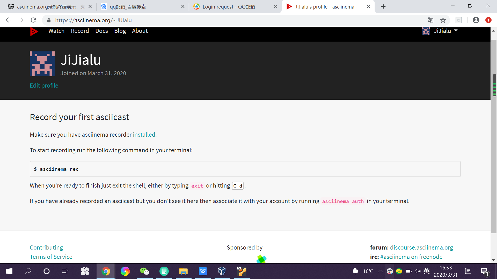
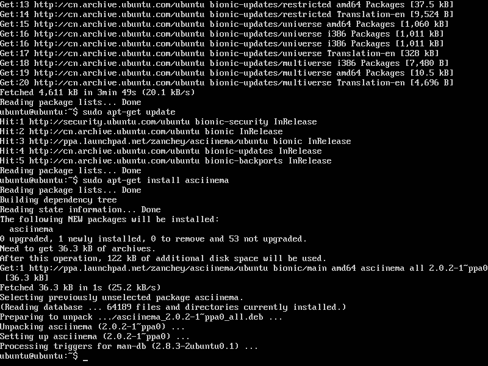

# From GUI to CLI

## 1.实验要求
- 注册asciinema账号并与本地用户相连
- 完成vimtutor任务并录屏
- 回答相关问题
  

## 2.实验环境
- Ubuntu 18.04 server 64bit
- asciinema

## 3.实验过程

- 在asciinema注册账号
 

- 连接本地账户和线上账户
  

- Lesson 1
 

- Lesson 2

- Lesson 3

- Lesson 4

- Lesson 5

- Lesson 6

- Lesson 7

## 4.回答问题

- 你了解vim有哪几种工作模式？
  
  - Normal mode 普通模式。文件初始为普通模式，其他情况也可通过“esc”键进入Normal mode.
  - Insert mode 插入模式。i,I,a,A,o,O,c等按键均可以进入Insert mode.
  - Visual mode 可视化模式。在Normal mode下按v,shift+v,ctrl+c均可进入Visual mode.

- Normal模式下，从当前行开始，一次向下移动光标10行的操作方法？如何快速移动到文件开始行和结束行？如何快速跳转到文件中的第N行？
   - 按“10j”可将光标向下移动10行
   - “gg”移动到文件开始，"G"文件结束
   - 'Ngg'或'NG'即可

- Normal模式下，如何删除单个字符、单个单词、从当前光标位置一直删除到行尾、单行、当前行开始向下数N行？
   - `x`删除单个字符
   - `dw`或`de`删除单个单词
   - `d$`删到行尾
   - `dd`删除单行
   - `行数+dd`当前行开始向下数N行

- 如何在vim中快速插入N个空行？如何在vim中快速输入80个-？
   - `[N]o` 快速插入N个空行
   - `[80]i-` 快速输入80个-

- 如何撤销最近一次编辑操作？如何重做最近一次被撤销的操作？
  - `u`撤销最近一次操作
  - `ctrl+r`重做最近一次被撤销的操作

- vim中如何实现剪切粘贴单个字符？单个单词？单行？如何实现相似的复制粘贴操作呢？
   - 在vim中最近一次删除的内容会在vim的剪切板中保留，因此粘贴只需要按`p`即可
   - `yy`复制一行，`[N]yy`复制N行，`yw`复制单个单词，`y`复制visual mode中选定的某一块
  
- 为了编辑一段文本你能想到哪几种操作方式（按键序列）？
   - 光标操作： `h,j,k,l,w,b,0,$` 
   - 查询操作：`/[search]`
   - 上/下翻页：`ctrl d,ctrl u`
   - 基本插入操作：`i,I,o,O,a,A`
   - 删除操作：`dd,d`
   - 保存并退出：`:x`

- 查看当前正在编辑的文件名的方法？查看当前光标所在行的行号的方法？
   - `ctrl+g`

- 在文件中进行关键词搜索你会哪些方法？如何设置忽略大小写的情况下进行匹配搜索？如何将匹配的搜索结果进行高亮显示？如何对匹配到的关键词进行批量替换？
   - /[关键字|匹配模式]，`n`下一个，`N`上一个
   - 忽略大小写：`set ic`
   - 搜索结果高亮：`set hlsearch`
   - 批量替换：``:x,y/old/new/g``

- 在文件中最近编辑过的位置来回快速跳转的方法？
   - `ctrl + o`,`ctrl + i`

- 如何把光标定位到各种括号的匹配项？例如：找到(, [, or {对应匹配的),], or }
   - 光标移动到某个符号，按`%`，即可到它对应的符号

- 在不退出vim的情况下执行一个外部程序的方法？
   - `![该程序名称]`

- 如何使用vim的内置帮助系统来查询一个内置默认快捷键的使用方法？如何在两个不同的分屏窗口中移动光标？
	- 查询一个内置默认快捷键的使用方法 :`:help [快捷键]`
	- 通过鼠标操作光标移动：`:set mouse=a`
	- 通过键盘操作光标移动：`ctrl + w + h/j/k/l`

## 5.实验收获
- 相较第一次实验，这次的实验感觉压力小了一些，对于ubuntu的基本原理和概念也熟悉起来，有了入门的感觉。
- 对于vim的快捷键操作还不是很熟悉，操作的录屏有很多“不太聪明”的操作，要继续学习进步。
- 这次实验专门去学习了markdown的编写方法，比上次看起来规范了不少。

