# WEB服务器搭建

## 实验环境
- ubuntu 18.04 server
- windows 10
- nginx
- verynginx
- wordpress
- DVWA

## 实验步骤

- 1.安装`nginx`
   - `sudo apt-get update`更新
     `sudo apt-get install nginx`安装
     `sudo nginx -t`验证是否成功安装
      - 错误：fastcgi_pass参数无效
        解决：删掉配置文件中相应行即可
   - 访问80窗口检验
     

- 2.安装`Verynginx`
  - 安装依赖
    `sudo apt install -y libpcre3-dev libssl1.0-dev zlib1g-dev python3 unzip gcc make`
  - 克隆verynginx仓库到本地
    `wget https://github.com/alexazhou/VeryNginx/archive/master.zip`
    `unzip master.zip` 
  - 修改Verynginx配置
     `cd VeryNginx-master/`
     `sed -i "2s/nginx/www-data/" nginx.conf`修改用户名为www-data
  - 安装verynginx
    `sudo python3 install.py install`
  - 创建软链接
    `sudo ln -s /opt/verynginx/openresty/nginx/sbin/nginx /usr/sbin/verynginx`
  - 检查是否成功
    `sudo verynginx -t`
    输出：
    `nginx: the configuration file /opt/verynginx/openresty/nginx/conf/nginx.conf syntax is ok`
    `nginx: configuration file /opt/verynginx/openresty/nginx/conf/nginx.conf test is successful`
  - 启动 
    `sudo verynginx`

  - 错误：nginx的HTTP服务没有打开
    
    解决：将nginx添加进防火墙中即可，激活utw
    
  - 访问80窗口检验：
    

- 3.安装``wordpress``
   - 下载并安装依赖
     - mysql数据库和php7.2
       `sudo apt install -y mysql-server php7.2-fpm php7.2-mysql php7.2-gd`
     - 配置mysql
       `sudo mysql -u root -p`以root用户身份进入

       - 创建wordpress使用的数据库
       `mysql> CREATE USER 'wordpress'@'localhost' IDENTIFIED 
       BY 'wordpress';`
       `mysql> CREATE DATABASE wp_db;`
       `mysql> GRANT ALL ON wp_db.* TO 'wordpress'@'localhost';`
       - 指定wordpress目录
       `WP_PATH=/var/www/wordpress`

       - 创建public文件夹
       `sudo mkdir -p ${WP_PATH}/public/`
       - 将用户改为www-data
         `sudo chown -R www-data:www-data ${WP_PATH}/public`
       - 下载并解压WorePress
         `wget https://wordpress.org/wordpress-4.7.zip`
         `unzip wordpress-4.7.zip`
       - 拷贝至public文件夹中
  `sudo cp -r wordpress/* ${WP_PATH}/public/
cd ${WP_PATH}/public/`
`sudo cp wp-config-sample.php wp-config.php`
       - 修改配置文件
`sudo sed -i s/database_name_here/wp_db/ wp-config.php
sudo sed -i s/username_here/wordpress/ wp-config.php
sudo sed -i s/password_here/wordpress/ wp-config.php`

- 4.连接`WordPress与Nginx`

```bash
# 新建配置文件，设置端口8080和文件名wp.sec.cuc.edu.cn
WP_DOMAIN=wp.sec.cuc.edu.cn
WP_PORT=8080
sudo tee /etc/nginx/sites-available/${WP_DOMAIN} << EOF
server {
    listen localhost:${WP_PORT};
    server_name ${WP_DOMAIN};

    root ${WP_PATH}/public;
    index index.php;

    location / {
        try_files \$uri \$uri/ /index.php?\$args;
    }

    location ~ \.php\$ {
        include snippets/fastcgi-php.conf;
        fastcgi_pass unix:/run/php/php7.2-fpm.sock;
    }
}
EOF
# 在sites-enabled中创建sites-available的软链接，并删除default
sudo ln -s /etc/nginx/sites-available/${WP_DOMAIN} /etc/nginx/sites-enabled/
sudo rm /etc/nginx/sites-enabled/default
# 启动nginx
sudo nginx
```
 - 5.配置VeryNginx访问wp.sec.cuc.edu.cn

添加匹配规则


添加Up Stream节点


添加Proxy Pass规则


保存


访问`wp.sec.cuc.edu.cn`就可以自动进入安装界面了，安装过程中可以设置博客Tittle，用户名，密码，邮箱等


-  6.安装```Dvwa```并配置```VeryNginx```


```bash
# 指定目录,更高用户名
DVWA_PATH=/var/www/dvwa
sudo mkdir -p ${DVWA_PATH}/public/
sudo chown -R www-data:www-data ${DVWA_PATH}/public

# 下载DVWA
wget https://github.com/ethicalhack3r/DVWA/archive/master.zip
unzip master.zip
# 拷贝文件到/var/www/dvwa下
sudo cp -r DVWA-master/* ${DVWA_PATH}/public/
cd ${DVWA_PATH}/public/
sudo cp config/config.inc.php.dist config/config.inc.php
# 更改配置文件,8000端口
DVWA_DOMAIN=dvwa.sec.cuc.edu.cn
DVWA_PORT=8000
sudo tee /etc/nginx/sites-available/${DVWA_DOMAIN} << EOF
server {
    listen localhost:${DVWA_PORT};
    server_name ${DVWA_DOMAIN};

    root ${DVWA_PATH}/public;
    index index.php;

    location / {
        try_files \$uri \$uri/ /index.php?\$args;
    }

    location ~ \.php\$ {
        include snippets/fastcgi-php.conf;
        fastcgi_pass unix:/run/php/php7.2-fpm.sock;
    }
}
EOF
# 错误：安装的是7.1但是配置中写了7.2导致test不通过：删除相应行即可

# 设置软链接
sudo ln -s /etc/nginx/sites-available/${DVWA_DOMAIN} /etc/nginx/sites-enabled/
# 重新载入配置
sudo nginx -s reload
```

添加匹配规则

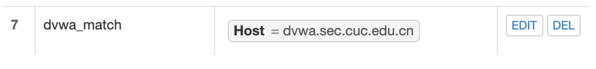

添加Up Stream节点


添加Proxy Pass 规则

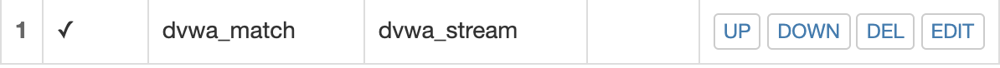

保存后访问`dvwa.sec.cuc.edu.cn`


- 7.用```WordPress```启用```HTTPS```

本实验中使用的是tsyitc

```bash
# 生成自签名证书
sudo openssl req -x509 -newkey rsa:4096 -nodes -subj "/C=CN/ST=Beijing/L=Beijing/O=CUC/OU=SEC/CN=wp.sec.cuc.edu.cn" -keyout key.pem -out cert.pem -days 365
# 将生成的cert.pem和key.pem放在/etc/nginx目录下
sudo mv cert.pem /etc/nginx/
sudo mv key.pem /etc/nginx/
# 修改/etc/nginx/sites-available/wp.sec.cuc.edu.cn 中的8080端口为”8443 ssl"
sudo sed -i "2s/8080/8443\ ssl" wp.sec.cuc.edu.cn
# 在第二行后添加cert.pem和key.pem
sudo sed -i '2a ssl_certificate      /etc/nginx/cert.pem;\nssl_certificate_key  /etc/nginx/key.pem;' wp.sec.cuc.edu.cn
```

在`/opt/verynginx/openresty/nginx/conf/nginx.conf`中修改server块，使verynginx监听443端口

```bash
server {
    listen 80;
    listen 443 ssl;
    ssl_certificate      /etc/nginx/cert.pem;
    ssl_certificate_key  /etc/nginx/key.pem;
    include /opt/verynginx/verynginx/nginx_conf/in_server_block.conf;

    location = / {
        root   html;
        index  index.html index.htm;
    }
}
```
重新加载配置文件

```bash
sudo nginx -s reload
sudo verynginx -s reload
```

由于刚才改了nginx对wordpress的配置文件，所以要重新去verynginx中设置一下

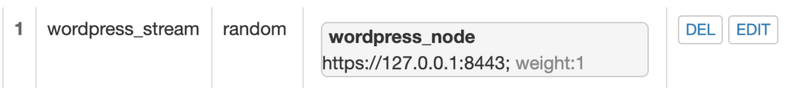

保存好之后可访问HTTP
因为此时还没有对verynginx访问强制限制https，所以`http://wp.sec.cuc.cn`和`https://wp.sec.cuc.cn`均可以访问，只是VeryNginx在访问Nginx时使用的https

在Scheme Lock添加规则并勾选Enable，即可强制访问https

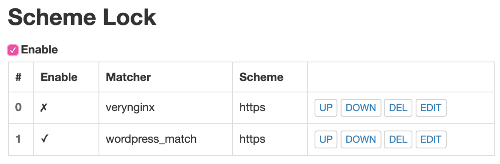

- 8.安全加固

   -使用IP地址方式均无法访问上述任意站点，并且向访问者展示自定义的友好错误提示信息页面


添加`Matcher`规则

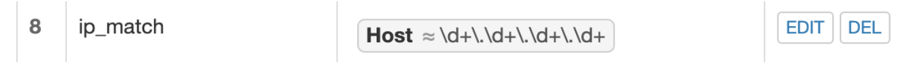

添加`Response`响应

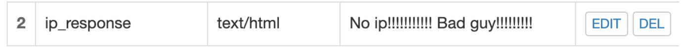

添加`Filter`


此时以ip形式访问，会出现对应的提示并拒绝

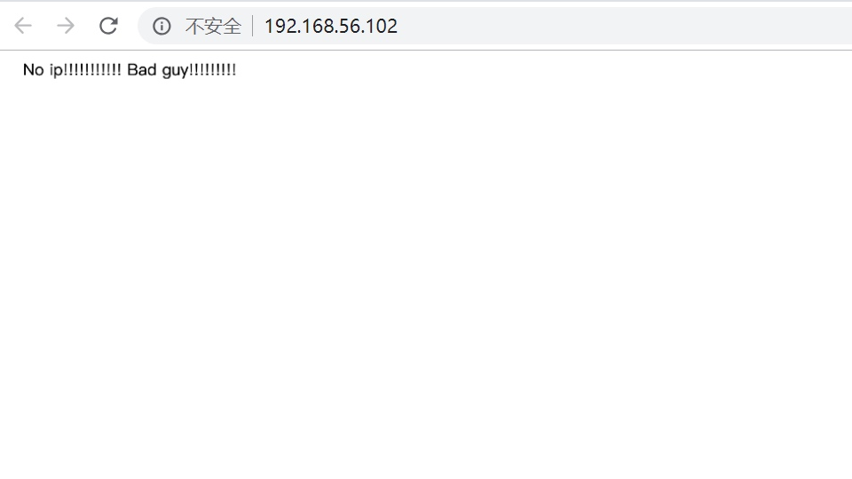


  - DVWA只允许白名单上的访客来源IP，其他来源的IP访问均向访客展示自定义的友好错误提示信息页面


   - 在白名单的客户端访问

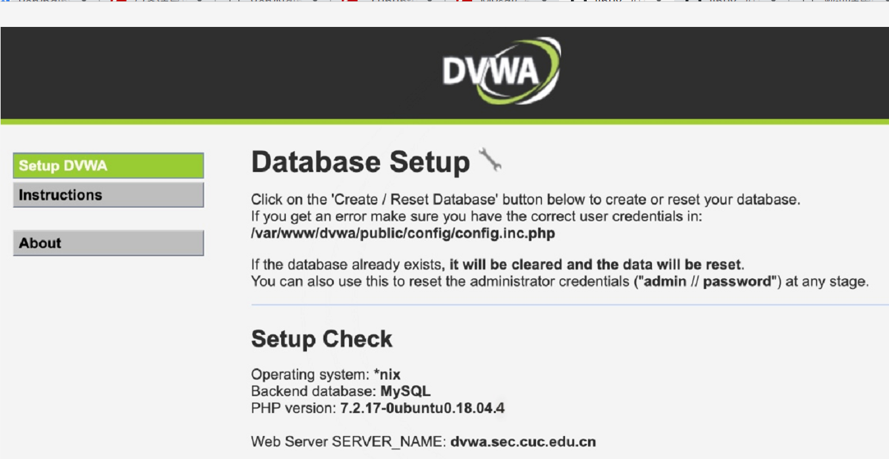

不在白名单的客户端访问


  - 在不升级Wordpress版本的情况下，通过定制VeryNginx的访问控制策略规则，热修复WordPress < 4.7.1 - Username Enumeration

   在Permalink Settings中设置Day and name


访问页面`wp.sec.cuc.edu.cn/wp-json/wp/v2/users/`可以看到用户信息

添加`^/wp-json/wp/v2/users.*`匹配和filter，拒绝即可


  - 通过配置VeryNginx的Filter规则实现对Damn Vulnerable Web Application (DVWA)的SQL注入实验在低安全等级条件下进行防护
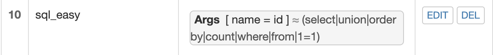


   - VeryNginx的Web管理页面仅允许白名单上的访客来源IP，其他来源的IP访问均向访客展示自定义的友好错误提示信息页面-3

与其他两个类似

添加`Matcher`

添加`Response`

添加`Filter`

白名单访问


非白名单访问

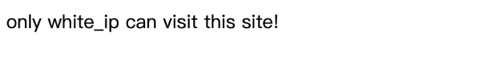


   - 限制DVWA站点的单IP访问速率为每秒请求数 < 50, 限制Wordpress站点的单IP访问速率为每秒请求数 < 20, 超过访问频率限制的请求直接返回自定义错误提示信息页面-4

添加`Response`


添加`Frequency Limit`

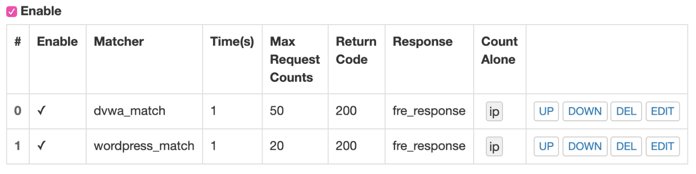

## 参考资料
  - https://github.com/CUCCS/linux-2019-luyj/blob/Linux_exp0x05/Linux_exp0x05/Linux_exp0x05.md
  - https://kifarunix.com/how-to-install-lamp-stack-apachemariadb-php-7-2-on-ubuntu-18-04-lts/
  
  - https://kifarunix.com/how-to-install-lamp-stack-apachemariadb-php-7-2-on-ubuntu-18-04-lts/
  - https://blog.csdn.net/weixin_33907511/article/details/94535509
  