# SHELL脚本编程练习进阶实验
> FTP、NFS、DHCP、DNS、Samba服务器的自动安装与自动配置

## 完成情况

- [x] FTP,NFS必选任务，已编写脚本完成
- [x] Samba,DHCP,DNS手动配置完成

## 实验环境

- ubuntu18.04-64
- 工作主机：cuc@cuc-svr，IP：192.168.56.101
- 目标主机：ubuntu@ubuntu，IP：192.168.56.1


> 将脚本从工作主机拷贝到目标主机

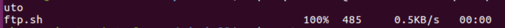

## FTP


- 配置提供匿名访问的FTP服务器:
- 匿名访问者可以访问1个目录且仅拥有该目录及其所有子目录的只读访问权限

    - TIPS：要在vsftpd.userlist中添加`anonymous`，才可以实现匿名访问

    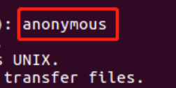

    

-   ftp必须要切换到相应目录下才能下载文件，而lftp可以指定路径直接下载文件


- 配置一个支持用户名和密码方式访问的账号:
- 该账号继承匿名访问者所有权限，且拥有对另1个独立目录及其子目录完整读写（包括创建目录、修改文件、删除文件等）权限
    - 在sammy用户的目录下出现了匿名用户目录下的文件，可证明继承匿名者访问权限

    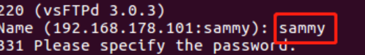

    - 删除文件、创建目录、修改文件

    

- FTP用户不能越权访问指定目录之外的任意其他目录和文件（**注意**：不是通过 绝对路径 方式来遍历，而是验证通过相对路径（如 cd ../../../../ ）方式无法翻出 FTP 服务器指定的当前用户的home 访问到 home及其所有子目录以外的任何其他目录）

    

    - 如果需要在命令行使用 FTP 客户端，首选不是 ftp ，而是另一款需要单独安装的 lftp


- 参考

    - [How To Set Up vsftpd for Anonymous Downloads on Ubuntu 16.04](https://www.digitalocean.com/community/tutorials/how-to-set-up-vsftpd-for-anonymous-downloads-on-ubuntu-16-04)
    - [How To Set Up vsftpd for a User's Directory on Ubuntu 16.04](https://www.digitalocean.com/community/tutorials/how-to-set-up-vsftpd-for-a-user-s-directory-on-ubuntu-16-04)
    - [vsftpd for both local users and anonymous logins](https://serverfault.com/questions/844935/vsftpd-for-both-local-users-and-anonymous-logins)

## NFS

- script
    
- 在1台Linux上配置NFS服务，另1台电脑上配置NFS客户端
- 挂载2个权限不同的共享目录，分别对应只读访问和读写访问权限

    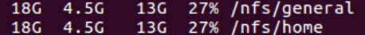

    - host的`/etc/exports`文件中，设置home目录为可读可写，general目录为只读（**注意**：设置home目录为 NFS 共享可读可写是非常危险的一件事情，会破坏 NFS 服务器上用户home目录的权限设置！）

    ```
    /var/nfs/general 192.168.56.101(sync,no_subtree_check)

    /home    192.168.56.101(rw,sync,no_root_squash,no_subtree_check)

    ```

    - 在客户端home目录中创建文件，注意不可在客户端general目录中创建文件


- 客户端共享目录中文件、子目录的属主、权限信息和在NFS服务器端上查看到的信息一样吗？

    - 客户端与服务器端一致的只是 uid 和 gid ，不同主机上的相同 uid 和 gid 并不意味着映射到相同的 用户名 和 组名

    - client

    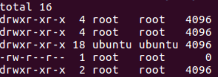

    - server

    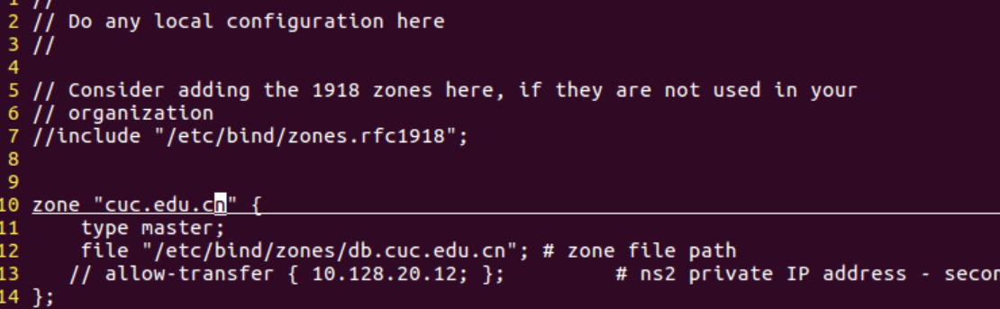

    - 参考资料解释

    > By default, NFS translates requests from a root user remotely into a non-privileged user on the server. This was intended as security feature to prevent a root account on the client from using the file system of the host as root. no_root_squash disables this behavior for certain shares.

    - 若没有`no_root_squash`参数(在general目录添加了写权限)
        - client

        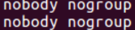

        - server

        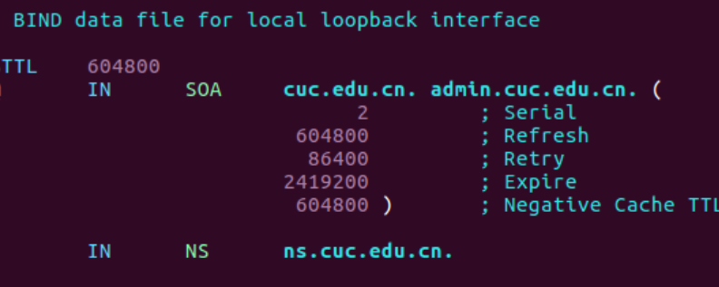

- 参考
    - [How To Set Up an NFS Mount on Ubuntu 18.04](https://www.digitalocean.com/community/tutorials/how-to-set-up-an-nfs-mount-on-ubuntu-18-04)

## Samba

### 在windows 10客户端上连接Linux上的Samba服务器

- 打开资源管理器，右键“此电脑”，选择“添加一个网络位置”

    

- 输入共享文件夹路径

    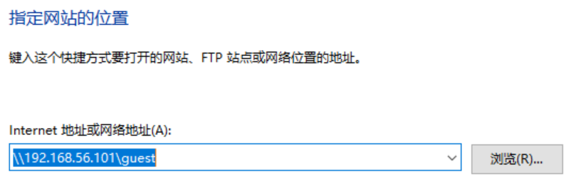

    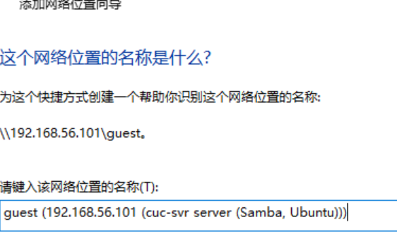

- 访问指定用户文件夹，需要输入账号密码，且可以创建文件夹

    

- 访问匿名目录，不用输入账号密码，且不可以创建文件夹

    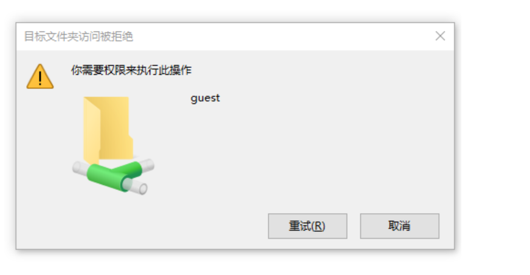

- 参考资料: [How to connect to Linux Samba shares from Windows 10](https://www.techrepublic.com/article/how-to-connect-to-linux-samba-shares-from-windows-10/)


### 在Linux上连接Windows10上的服务器

> sudo apt-get install smbclient


- Linux访问Windows的匿名共享目录

    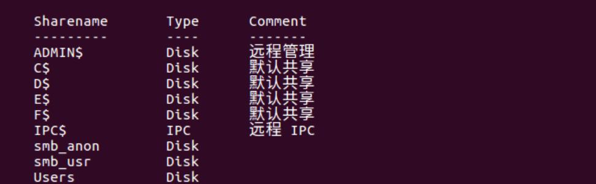

     - 参考资料：[How to Create Network File Shares with No Passwords in Windows 8](https://www.howtogeek.com/126214/how-to-create-network-file-shares-with-no-passwords-in-windows-8/)


- Linux访问Windows的用户名密码方式共享目录

    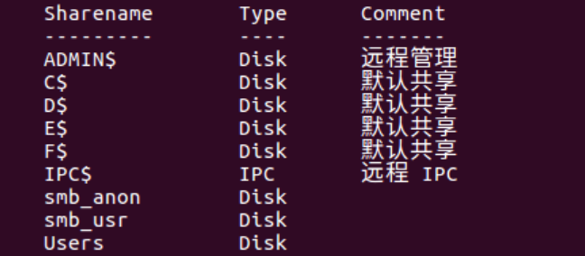

- 下载整个目录


    - 参考资料: [Getting whole folder using Smbclient](https://indradjy.wordpress.com/2010/04/14/getting-whole-folder-using-smbclient/)

- 参考
    - [安装和配置SAMBA独立共享服务器](http://sec.cuc.edu.cn/huangwei/course/LinuxSysAdmin/chap0x06.md.html#/samba)
    - [Cannot restart samba, samba.service is masked](https://askubuntu.com/questions/754572/cannot-restart-samba-samba-service-is-masked)

## DHCP

- `sudo apt install isc-dhcp-server`

- 修改`/etc/default/isc-dhcp-server`文件

    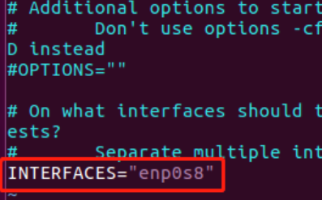

- 修改`/etc/dhcp/dhcpd.conf`文件


- 重启服务：`sudo service isc-dhcp-server restart`

- 测试

    - server

        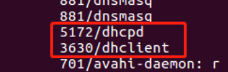

    - client

        - 更改`/etc/network/interfaces`文件

        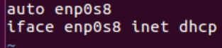

- 参考
    - [Setup DHCP server on ubuntu 16.04 (Xenial Xerus) Server](http://www.ubuntugeek.com/setup-dhcp-server-on-ubuntu-16-04-xenial-xerus-server.html)

## DNS

- server

    - 安装Bind: `sudo apt-get install bind9 bind9utils bind9-doc`

    - 设置信任客户端：`sudo vi /etc/bind/named.conf.options`，添加

    ```

    acl "trusted" {
          192.168.56.102;    # ns1 - can be set to localhost
  	};  

    ```

    在options选项中添加

    ```
    	recursion yes;                 # enables resursive queries
        allow-recursion { trusted; };  # allows recursive queries from "trusted" clients
        listen-on { 192.168.56.101; };   # ns1 private IP address - listen on private network only
        allow-transfer { none; };      # disable zone transfers by default

        forwarders {
                8.8.8.8;
                8.8.4.4;
        };

    ```

    - 编辑`sudo vi /etc/bind/named.conf.local`

    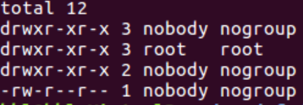

    - sudo mkdir /etc/bind/zones
    - cd /etc/bind/zones
    - sudo cp ../db.local ./db.cuc.edu.cn

    - 编辑`sudo vi /etc/bind/zones/db.cuc.edu.cn`

    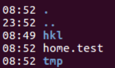

    - 重启bind9：`sudo service bind9 restart`


- client
    - `sudo vi /etc/resolvconf/resolv.conf.d/head`

    - `sudo resolvconf -u`


- 参考资料
    - [How To Configure BIND as a Private Network DNS Server on Ubuntu 14.04](https://www.digitalocean.com/community/tutorials/how-to-configure-bind-as-a-private-network-dns-server-on-ubuntu-14-04#prerequisites)

## 其他参考资料


- [How to include file in a bash shell script](https://stackoverflow.com/questions/10823635/how-to-include-file-in-a-bash-shell-script)
- [Check whether a user exists](https://stackoverflow.com/questions/14810684/check-whether-a-user-exists)
- [Check if a directory exists in a shell script](https://stackoverflow.com/questions/59838/check-if-a-directory-exists-in-a-shell-script)
- [How to append multiple lines to a file](https://unix.stackexchange.com/posts/77278/edit)
- [passing arguments to an interactive program non interactively
](https://stackoverflow.com/questions/14392525/passing-arguments-to-an-interactive-program-non-interactively)
