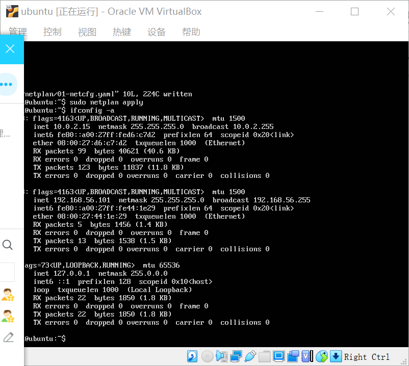
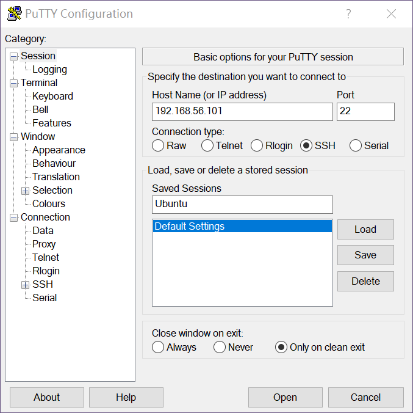
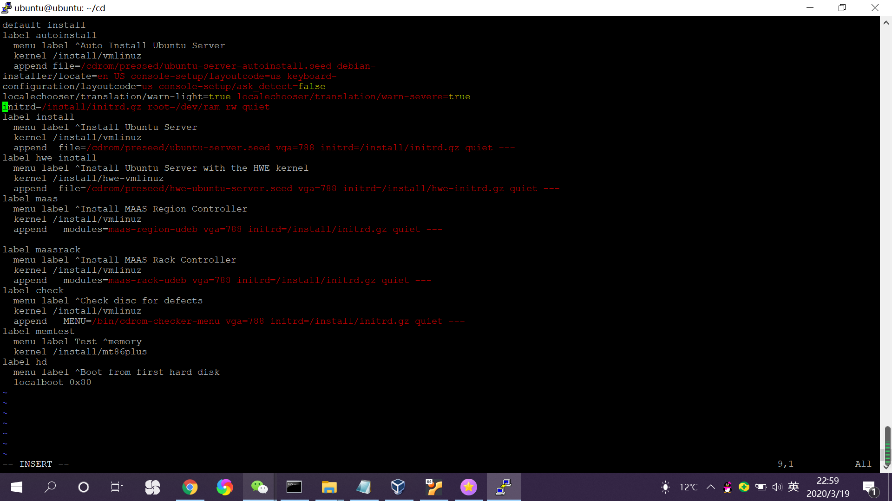
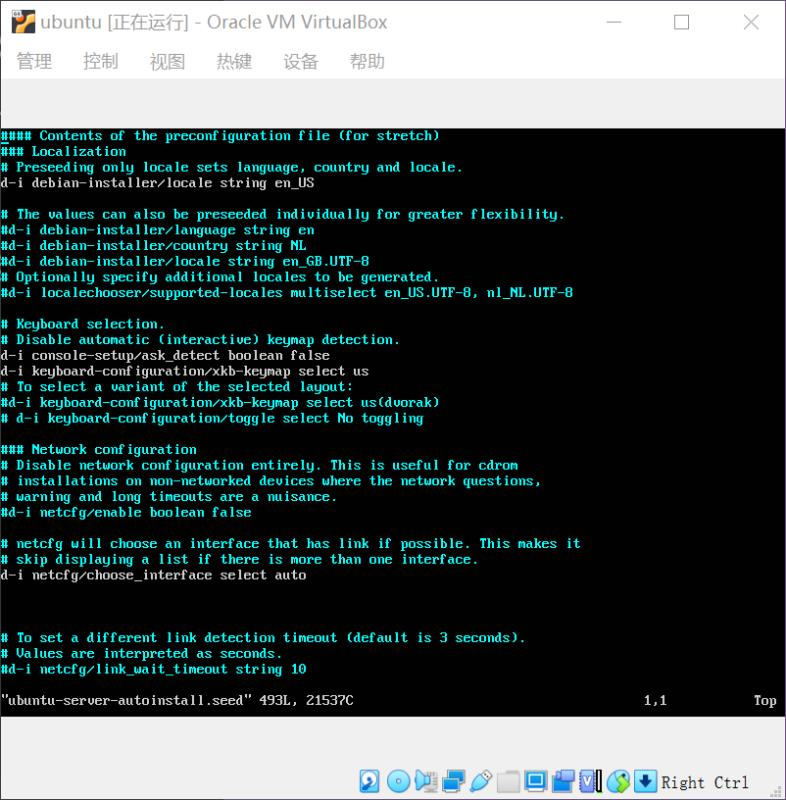
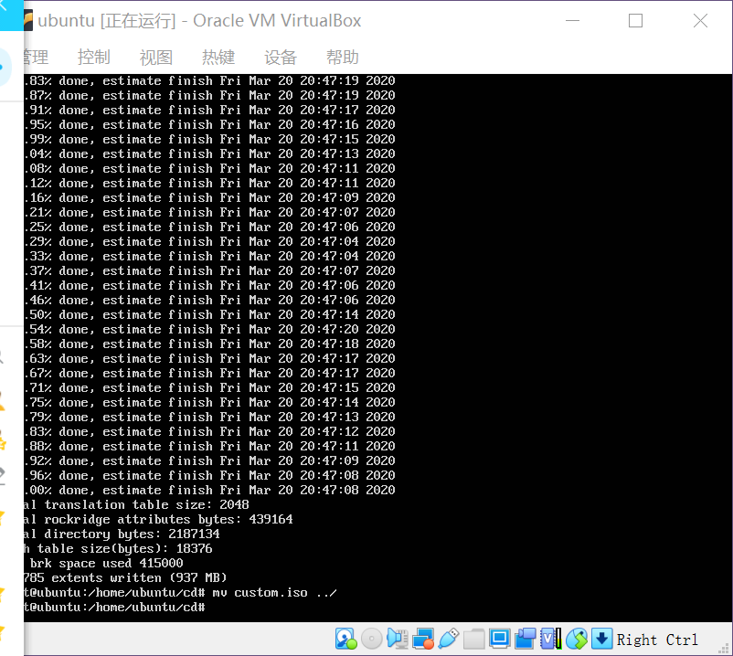
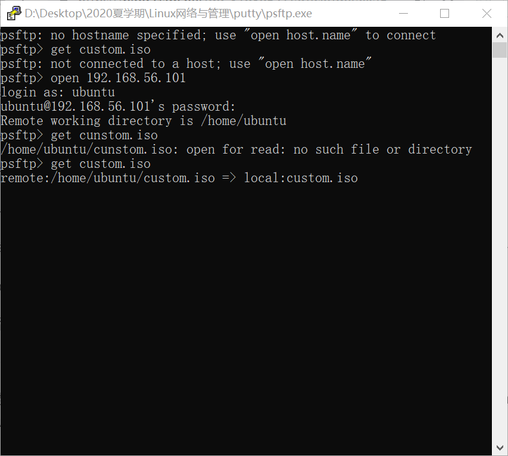

# 无人值守ubuntu镜像安装

### 实验内容：
-如何无人值守安装iso并在virtualbox中完成自动化安装
-virtualbox安装完Ubuntu之后新添加的网卡如何实现系统开机自动启用和自动获取IP？
-如何使用sftp在虚拟机和宿主机之间传输文件？

## 一.安装环境：
-virtualbox
-Ubuntu-18.04.4-server-amd64.iso
-putty

## 二.实验步骤

    1.安装virtualbox和有人值守安装Ubuntu系统

      -在清华镜像网站https://mirror.tuna.tsinghua.edu.cn/ubuntu-cdimage/releases/18.04/release/下载ubuntu-18.04.4-server-amd64.iso

      -官网下载virtualbox并安装

      -在virtualbox中新建虚拟机，配置磁盘、光驱、启动顺序、网络等

      -有人值守安装ubuntu

    2.启动已装好的ubuntu server

## 
      
     3.检验host-only网卡和NAT网卡是否可以自动启动并获取IP
## 

       自动获取失败了，手动输入vim etc/netplan 输入i进入编辑模式，手动添加host-only网卡的配置 保存退出
## 

    3.下载putty并连接
## 

    4.使用psfcp将ubuntu-18.0404-server-amd64.iso克隆进虚拟机中
      在传输的过程中发现permission denied,于是使用python环境在cmd命令行里传输
## 

    5.在putty中运行
     1）在putty中创建用于挂载镜像文件的目录  
        mkdir loopdir

     2）挂载镜像到新建的目录
        mount -o loop ubuntu-16.04.1-server-amd64.iso loopdir

     3）创建用于克隆光盘内容的目录
        mkdir cd

     4）同步光盘内容到目标目录
        rsync -av loopdir/ cd
     
     5）卸载iso镜像
        umount loopdir

     6）进入目标工作目录
        cd cd/
    
     7）编辑ubuntu安装引导界面
        vim isolinux/txt.cfg
      
     8）添加内容后保存退出
## 

    6.把老师提供seeed资源下载并保存到/home/ubuntu/cd/preseed/ubuntu-server-autoinstall.seed中
      1）这一步尝试了共享粘贴板和下载增强功能没有成功，没有实现windows和ubuntu的复制粘贴
      2）所以把宿主机的seed文件改名字成ubuntu-server-autoinstall,把虚拟机中的空文档删掉，然后用psftp传进去，再移动到指定目录
## 
      
    7.重新生成md5sum.txt
      sudo su -
cd /home/cuc/cd && find . -type f -print0 | xargs -0 md5sum > md5sum.txt
     
    8.封闭修改好的目录到.iso
      IMAGE=custom.iso
      BUILD=/home/ubuntu/cd/
    
      mkisofs -r -V "Custom Ubuntu Install CD" \
            -cache-inodes \
            -J -l -b isolinux/isolinux.bin \
            -c isolinux/boot.cat -no-emul-boot \
            -boot-load-size 4 -boot-info-table \
            -o $IMAGE $BUILD
       
       -mkisofs命令出现了“command not find”提示，于是安装了指令
        apt-get update
        apt-get install genisoimage

    9.移出已生成的cuntom.iso文件
      mv custom.iso ../
## 
    
    10.用psftp复制出镜像文件
## 
   
    11.新建虚拟电脑并配置，实现无人值守安装ubuntu
      录屏视频链接：

##### <https://mp.weixin.qq.com/s/UFqAHNxMbplUETtPQGw4Fw>
  
## 参考资料

   <https://blog.csdn.net/qq_31989521/article/details/58600426>
   <https://github.com/CUCCS/linux-2019-Wzy-CC/pull/1/commits/84f0cfd7dc9e78c0e0497a3adfa15eec3d190733>
   
## 收获与总结
    这次实验让我从对“搞机”一窍不通到独立实现了无人值守，过程很痛苦，但是收获满满，最后也很有成就感。以后应该多多关注计算机基础，对术语、原理等应该了解得更多，才能够避免看教程像看“天书”一样的感觉；同时也要多多探索，勇于试错，练就在坑中行走自如的本领。以后继续加油叭！
    
    
